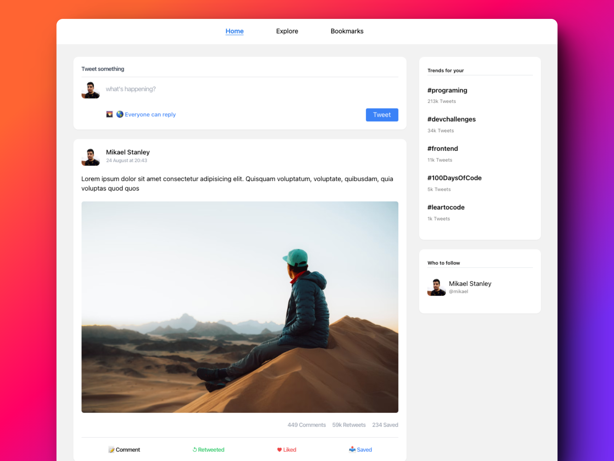

> **🚧 This project is under development 🚧**

## ✏️ Prerequisites

## ⚙️ Stack

- [**Next.js 13 /app directory** + **Typescript**](https://nextjs.org/) - The React Framework.
- [**Tailwind CSS** + **Tailwind-Merge** + **clsx**](https://tailwindcss.com/) - Tailwind CSS is a utility-first CSS framework.
- [**Radix UI**](https://www.radix-ui.com/primitives) - An open source component library .
- [**Prisma**](https://www.prisma.io/) - ORM for Node.js & TypeScript.
- [**Docker**](https://www.docker.com/) - Development environment.

## 📦 Environment Variables

## 🚀 Getting Started

## ☁ Deploys
